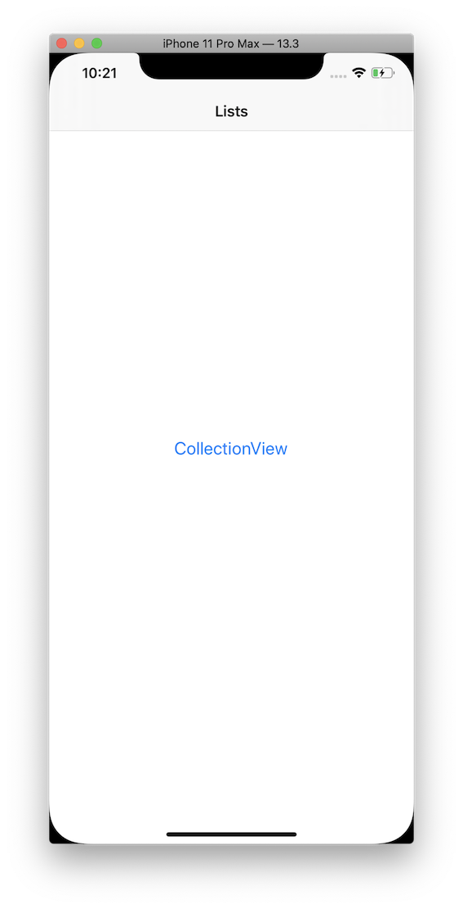

# SwipeOptions
A UI control to add functionality for showing options on CollectionViewCell on swipe.

## Implementation

* A "SwipeOptionsKit" project is created with a framework target. This will be used to add swipe functionality.
* A "SwipeOptions" project is created to test this framework with UICollectionView.
* The "SwipeOptionsKit" framework project is sub-project of "SwipeOptions" project for simplicity.
* The supported behaviours are:
    * Left and Right swipe.
    * Multiple actions support.
    * Tap to hide and scroll to hide.
    * Show and hide programatically.

> The Sample app and Framework is tested only on simulator as a real device was not available for testing. Not tested with lower deployment target version.

## Screenshots

### Screen to list the available examples:

### CollectionView example screen and options:

## Suggested improvements
* **More UI configuration options.**
* Support for UItableView. The custom UITableViewCell wil be almost similar to the UICollectionViewCell.
* Capability to show actions on all the sides.
* More robust sample project.
* More testing
